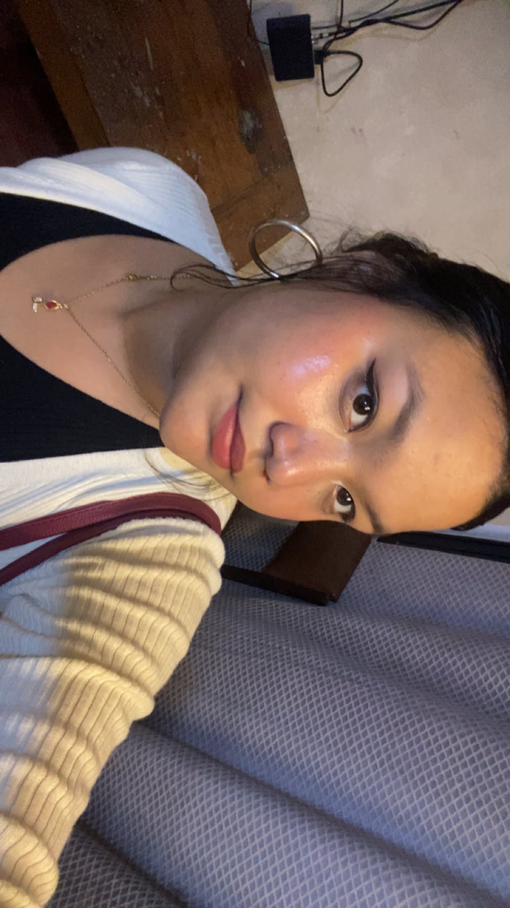

<!DOCTYPE html>
<html lang="en">
<head>
    <meta charset="utf-8">
    <meta name="viewport" content="width=device-width, initial-scale=1.0">
    <title>Riya Shakya - Personal Portfolio</title>
    <meta name="description" content="Personal portfolio of Riya Shakya">
</head>

<body>

    <a href="#main-content">Move to main content</a>

    <header>
        <h1>Riya Shakya</h1>

        
Student | Web Development | Database Management

        <nav aria-label="Primary navigation">
            <ul>
                <li><a href="#about-me">About Me</a></li>
                <li><a href="#skills">Skills</a></li>
                <li><a href="#projects">Projects</a></li>
                <li><a href="#education">Education</a></li>
                <li><a href="#contact">Contact</a></li>
            </ul>
        </nav>
    </header>

    <main id="main-content">

        <section id="about-me">
            <h2>About Riya Shakya</h2>

            

            

                My name is Riya Shakya, and I am a student interested in
                technology, web development, database management, and
                software engineering. I enjoy learning new technologies
                and developing simple and useful digital projects.
            

            

                I like learning through practical activities because they
                help me understand technical concepts more clearly. My goal
                is to improve my technical knowledge and create meaningful
                projects using technology.
            

        </section>

        <section id="skills">
            <h2>Technical Skills</h2>

            <dl>
                <dt>HTML5</dt>
                <dd>Creating structured and semantic web pages.</dd>

                <dt>CSS</dt>
                <dd>Basic understanding of webpage styling and layout.</dd>

                <dt>JavaScript</dt>
                <dd>Creating basic interactive features for websites.</dd>

                <dt>MySQL</dt>
                <dd>Creating, managing, and querying databases.</dd>

                <dt>GitHub</dt>
                <dd>Managing and sharing source code using repositories.</dd>
            </dl>
        </section>

        <section id="projects">
            <h2>Projects</h2>

            <article>
                <h3>CloudNewaBox</h3>

                

                    CloudNewaBox is a software engineering project based
                    on a Newari food Bento Box service. The project allows
                    customers to browse Newari foods, create their own
                    Bento Box, customize food preferences, select
                    occasions, and place orders.
                

                

                    <a href="https://github.com/RiyaShakya4/CloudNewaBox"
                       target="_blank"
                       rel="noopener noreferrer">
                        View CloudNewaBox Repository
                    </a>
                

            </article>

            <article>
                <h3>Database Management System</h3>

                

                    This project focused on designing and managing
                    relational databases using MySQL. It included creating
                    tables, primary keys, foreign keys, constraints,
                    relationships, and SQL queries.
                

                

                    <a href="https://github.com/RiyaShakya4/Database-Management-System"
                       target="_blank"
                       rel="noopener noreferrer">
                        View Database Management System Repository
                    </a>
                

            </article>

            <article>
                <h3>Personal Portfolio</h3>

                

                    This project is a single-page personal portfolio
                    created using semantic HTML5. It contains information
                    about me, my technical skills, projects, education,
                    and a contact form.
                

                

                    <a href="https://github.com/RiyaShakya4/personal-protfolio"
                       target="_blank"
                       rel="noopener noreferrer">
                        View Personal Portfolio Repository
                    </a>
                

            </article>
        </section>

        <section id="education">
            <h2>Education</h2>

            <article>
                <h3>Bachelor's Degree</h3>
                
International American University

                
Currently Studying

            </article>

            <article>
                <h3>Higher Secondary Education</h3>
                
Uniglobe SS College

                
Completed

            </article>

            <article>
                <h3>Secondary Education</h3>
                
Saraswati Boarding Higher Secondary School

                
Completed

            </article>
        </section>

        <section id="contact">
            <h2>Contact Me</h2>

            <form action="#" method="post">

                

                    <label for="name">Name:</label>
                    <input type="text"
                           id="name"
                           name="name"
                           required>
                

                

                    <label for="email">Email:</label>
                    <input type="email"
                           id="email"
                           name="email"
                           required>
                

                

                    <label for="message">Message:</label>
                    <textarea id="message"
                              name="message"
                              rows="6"
                              cols="40"
                              required></textarea>
                

                

                    <button type="submit">Submit</button>
                

            </form>
        </section>

    </main>

    <footer>
        
&copy; 2026 Riya Shakya. All Rights Reserved.

        
Designed and Developed by Riya Shakya

    </footer>

</body>
</html>
